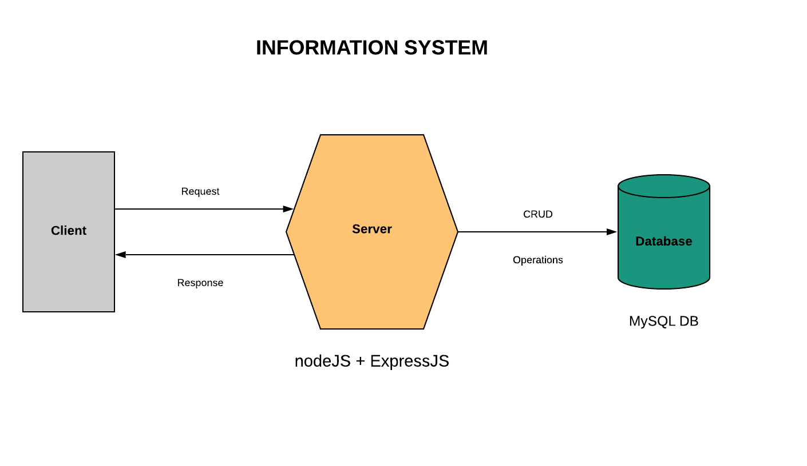

# dark-light

## Introduction
`dark-light` is a simple webApp to get stats about clicks on a switch to change light mode into dark mode.

The project is developed with JavaScript and runs on the [nodeJS](https://nodejs.org/en/) runtime.

All frontend parts (HTML, CSS & JS) are vanilla  - they don't use any kind of library.

The backend parts consist of a server developed with the [Express](https://expressjs.com/) framework and a [MySQL](https://www.mysql.com/) database.

The template engine used to generate HTML is [`pug`](https://pugjs.org/api/getting-started.html).

## Endpoints
* `GET /` - Return the index page of the webApp
* `GET /stats` - See a JSON response with statistics of clicks on the switch
* `POST /switches` - Send a POST request from client to server to add a new click information on the `switches` database table